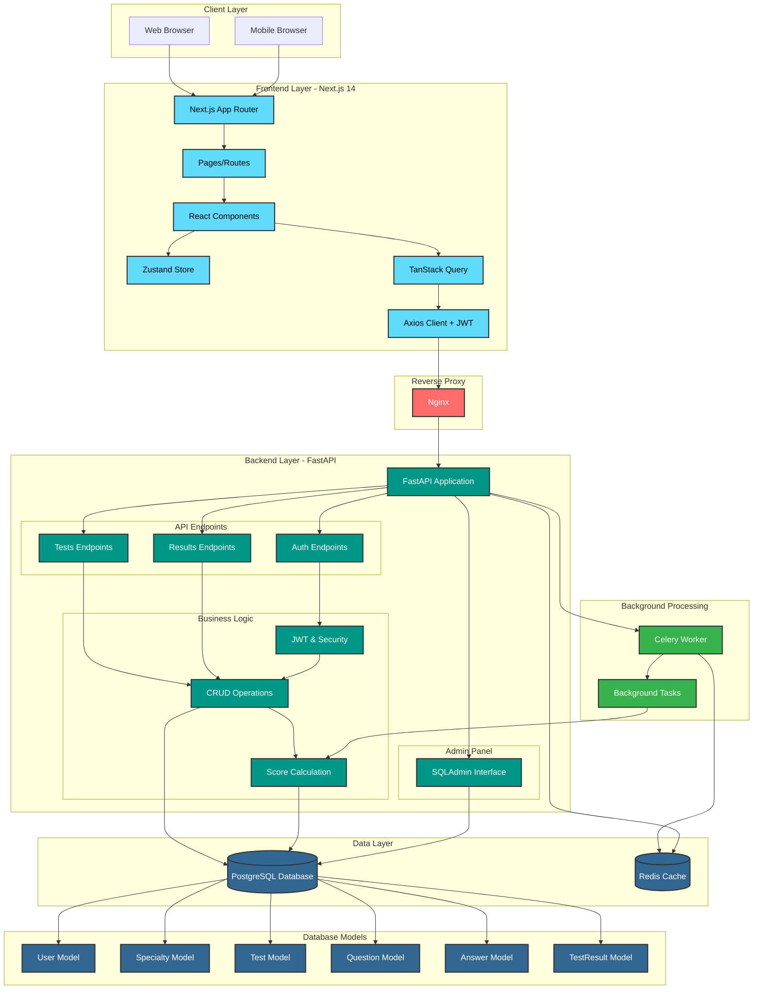
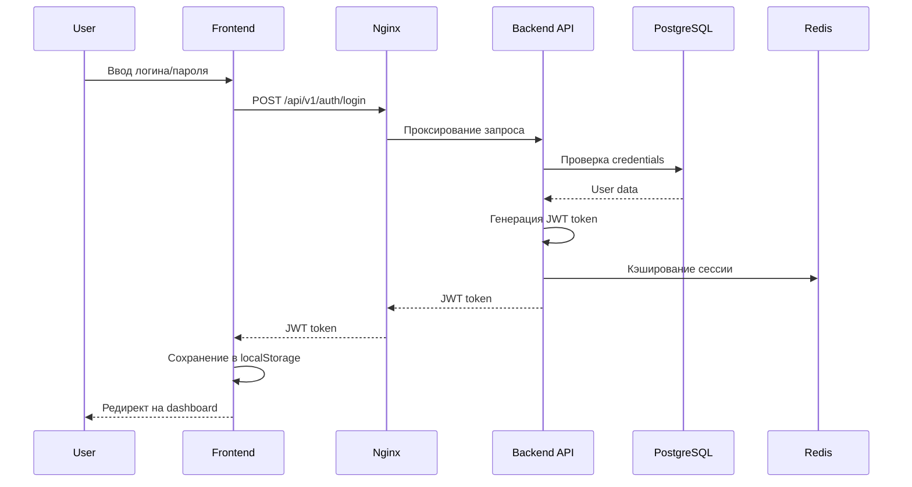
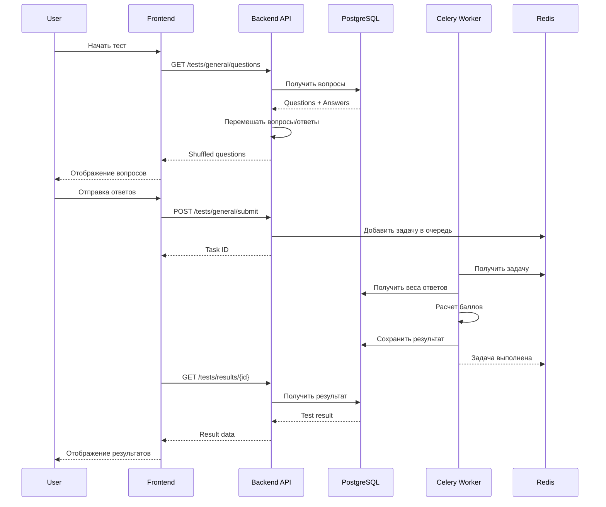
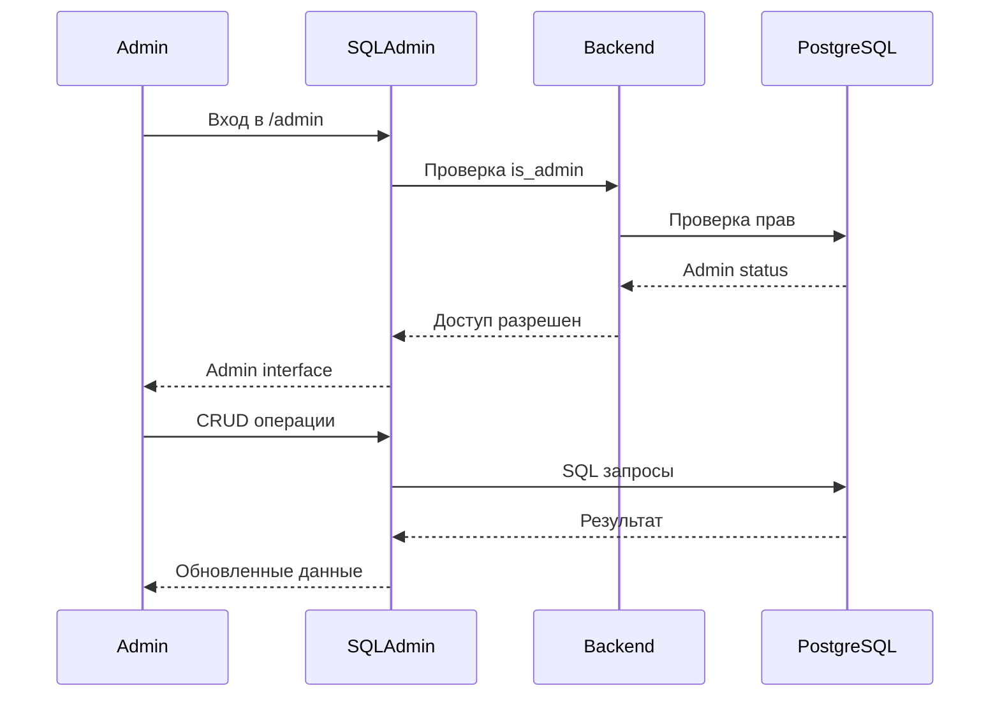
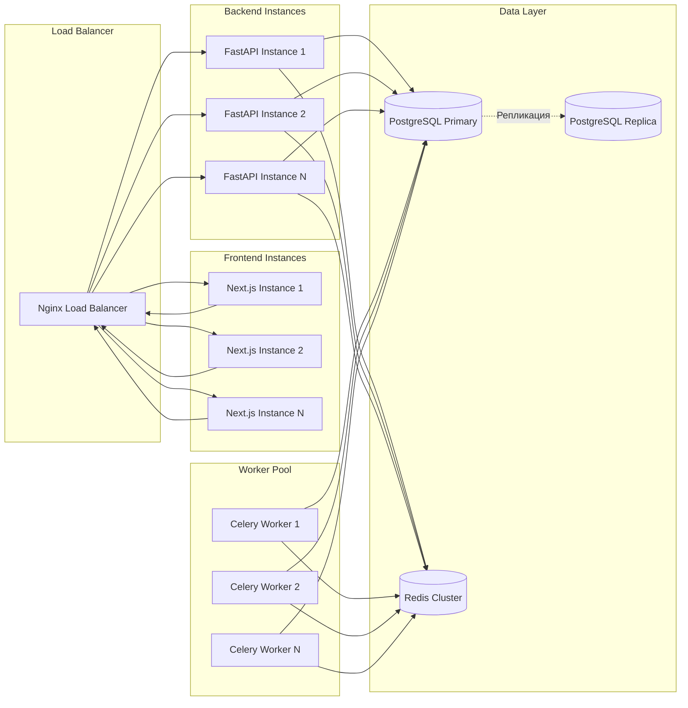
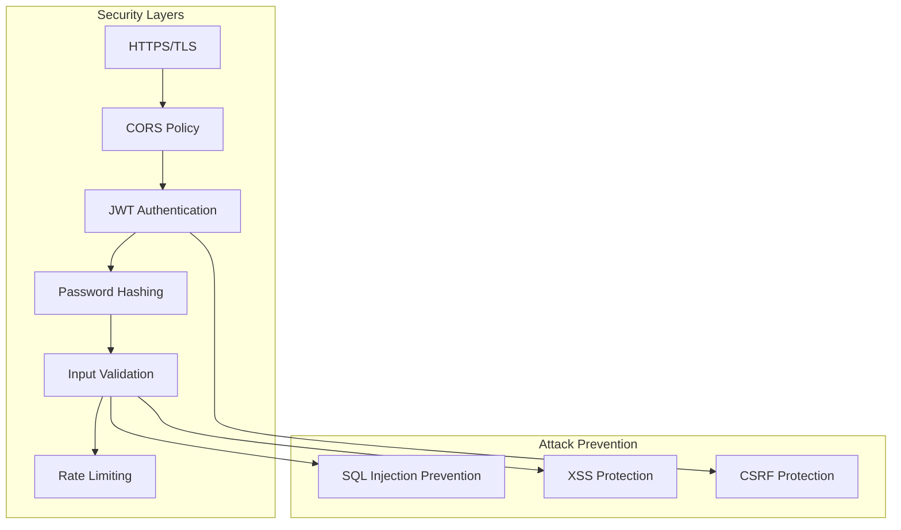
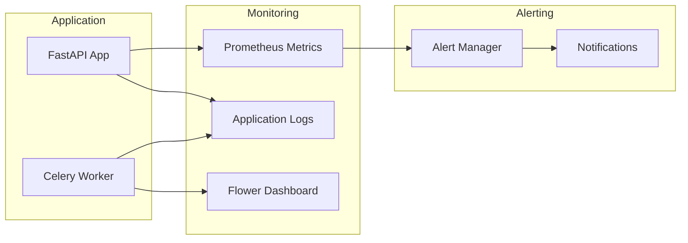

# Блок-схема всей системы IT Navigator

## Общая архитектура системы

## Потоки данных

### 1. Аутентификация пользователя

### 2. Прохождение теста

### 3. Административная панель

## Компоненты системы

### Frontend (Next.js 14)
- **App Router**: Маршрутизация на основе файловой системы
- **React Components**: Переиспользуемые UI компоненты
- **Zustand**: Управление состоянием клиента
- **TanStack Query**: Кэширование и синхронизация данных с сервером
- **Axios**: HTTP клиент с JWT interceptor

### Backend (FastAPI)
- **API Endpoints**: RESTful API с автодокументацией
- **SQLAlchemy**: Async ORM для работы с БД
- **JWT Authentication**: Токен-based аутентификация
- **Pydantic**: Валидация данных и схемы
- **SQLAdmin**: Административная панель

### Background Processing (Celery)
- **Celery Worker**: Асинхронная обработка задач
- **Redis**: Брокер сообщений и кэш
- **Tasks**: Расчет баллов, генерация PDF

### Database (PostgreSQL)
- **Users**: Пользователи системы
- **Specialties**: IT-специальности (F1-F7)
- **Tests**: Общие и специализированные тесты
- **Questions**: Вопросы тестов
- **Answers**: Варианты ответов с весами
- **TestResults**: Результаты прохождения тестов

### Infrastructure
- **Docker Compose**: Оркестрация контейнеров
- **Nginx**: Reverse proxy и статика
- **Redis**: Кэш и очередь задач

## Масштабирование

## Безопасность

## Мониторинг и логирование

