# Схема интерфейса IT Navigator

## Структура навигации

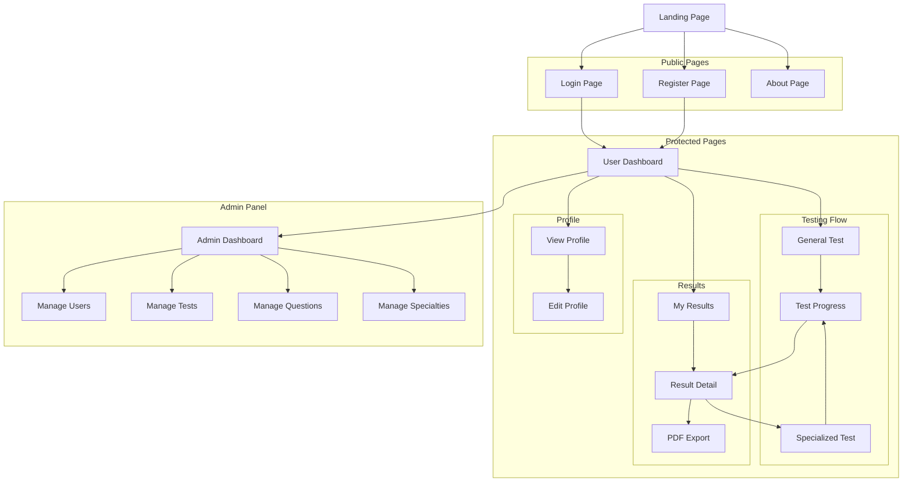

## Wireframes основных страниц

### 1. Landing Page

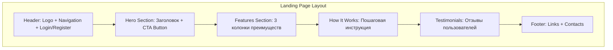

**Компоненты:**
- **Header**: Навигация, кнопки входа/регистрации
- **Hero**: Главный заголовок "Найди свою IT-специальность", кнопка "Начать тест"
- **Features**: Карточки с преимуществами (адаптивное тестирование, детальная аналитика, рекомендации)
- **How It Works**: Шаги 1-2-3 с иконками
- **Footer**: Ссылки на соцсети, контакты, политика конфиденциальности

### 2. Dashboard

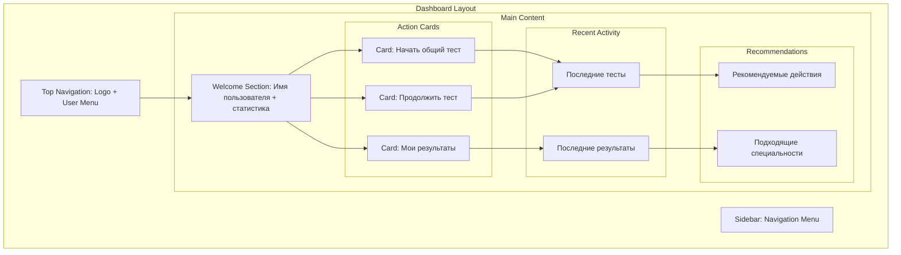

**Компоненты:**
- **Top Navigation**: Логотип, поиск, уведомления, аватар пользователя
- **Sidebar**: Меню навигации (Dashboard, Tests, Results, Profile, Admin)
- **Welcome Section**: Приветствие, статистика (пройдено тестов, средний балл)
- **Action Cards**: Крупные кнопки для основных действий
- **Recent Activity**: Таблица/список последних активностей
- **Recommendations**: Персонализированные рекомендации

### 3. Test Page (General/Specialized)

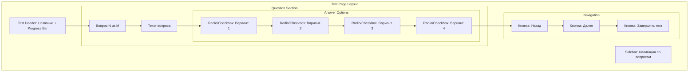

**Компоненты:**
- **Test Header**: Название теста, прогресс-бар (X из Y вопросов)
- **Question Section**: Номер вопроса, текст вопроса, варианты ответов
- **Answer Options**: Radio buttons (один ответ) или Checkboxes (несколько ответов)
- **Navigation**: Кнопки навигации между вопросами
- **Sidebar**: Миниатюры всех вопросов с индикацией ответов (отвечен/не отвечен)
- **Timer** (опционально): Таймер прохождения теста

### 4. Results Page

```mermaid
graph TB
    subgraph "Results Page Layout"
        ResultHeader[Result Header: Дата + Тип теста]
        
        subgraph "Score Overview"
            TotalScore[Общий балл]
            ScoreChart[Radar Chart: Баллы по специальностям]
        end
        
        subgraph "Specialty Breakdown"
            Specialty1[F1: Программирование - 85%]
            Specialty2[F2: Администрирование - 72%]
            Specialty3[F3: Дизайн - 45%]
            SpecialtyN[F7: Управление - 60%]
        end
        
        subgraph "Recommendations"
            TopSpecialties[Топ-3 подходящие специальности]
            NextSteps[Рекомендуемые действия]
            SpecializedTestCTA[CTA: Пройти специализированный тест]
        end
        
        subgraph "Actions"
            DownloadPDF[Кнопка: Скачать PDF]
            ShareResults[Кнопка: Поделиться]
            RetakeTest[Кнопка: Пройти заново]
        end
    end
    
    ResultHeader --> TotalScore
    TotalScore --> ScoreChart
    ScoreChart --> Specialty1
    Specialty1 --> Specialty2
    Specialty2 --> Specialty3
    Specialty3 --> SpecialtyN
    
    SpecialtyN --> TopSpecialties
    TopSpecialties --> NextSteps
    NextSteps --> SpecializedTestCTA
    
    SpecializedTestCTA --> DownloadPDF
    DownloadPDF --> ShareResults
    ShareResults --> RetakeTest
```

**Компоненты:**
- **Result Header**: Дата прохождения, тип теста, общий балл
- **Score Chart**: Радар-диаграмма с баллами по всем специальностям
- **Specialty Breakdown**: Список специальностей с процентами и прогресс-барами
- **Recommendations**: Персонализированные рекомендации на основе результатов
- **Actions**: Кнопки для скачивания PDF, повторного прохождения

### 5. Admin Panel

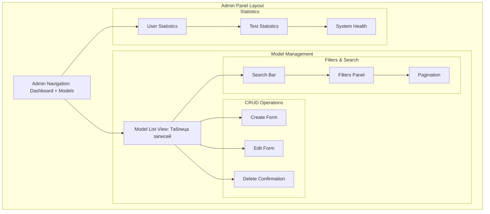

**Компоненты:**
- **Admin Navigation**: Меню с моделями (Users, Tests, Questions, Answers, Specialties)
- **Model List**: Таблица с данными, сортировка, фильтры
- **CRUD Forms**: Формы создания/редактирования записей
- **Statistics**: Дашборд с метриками и графиками

## UI Components Library

### Базовые компоненты

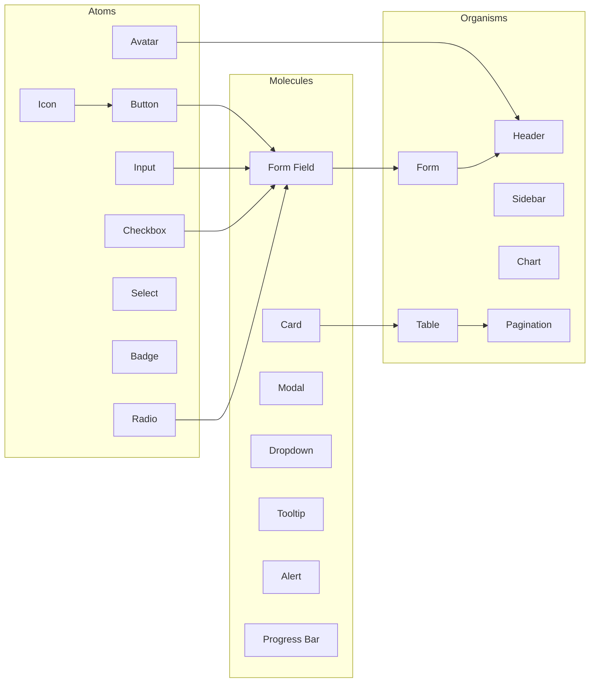

### Дизайн-система

**Цветовая палитра:**
- Primary: `#3B82F6` (Blue)
- Secondary: `#8B5CF6` (Purple)
- Success: `#10B981` (Green)
- Warning: `#F59E0B` (Orange)
- Error: `#EF4444` (Red)
- Background: `#0F172A` (Dark Blue)
- Surface: `#1E293B` (Dark Gray)
- Text: `#F1F5F9` (Light Gray)

**Типографика:**
- Heading 1: `32px / 2rem` - Bold
- Heading 2: `24px / 1.5rem` - Bold
- Heading 3: `20px / 1.25rem` - Semibold
- Body: `16px / 1rem` - Regular
- Small: `14px / 0.875rem` - Regular
- Caption: `12px / 0.75rem` - Regular

**Spacing:**
- xs: `4px`
- sm: `8px`
- md: `16px`
- lg: `24px`
- xl: `32px`
- 2xl: `48px`

**Border Radius:**
- sm: `4px`
- md: `8px`
- lg: `12px`
- xl: `16px`
- full: `9999px`

## Responsive Design

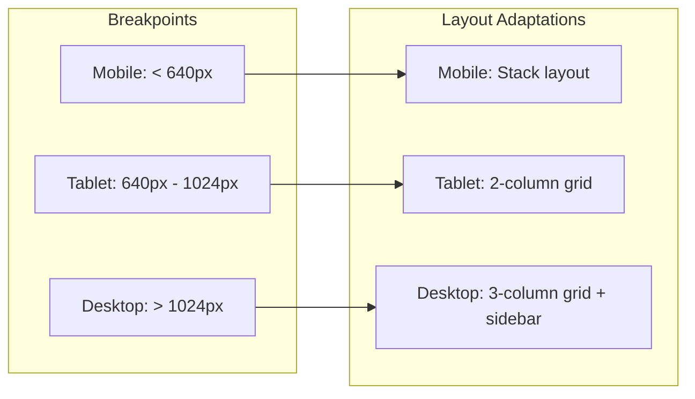

**Mobile (< 640px):**
- Hamburger menu
- Single column layout
- Touch-friendly buttons (min 44px)
- Bottom navigation bar

**Tablet (640px - 1024px):**
- Collapsible sidebar
- 2-column grid
- Adaptive cards

**Desktop (> 1024px):**
- Fixed sidebar
- 3-column grid
- Hover states
- Keyboard shortcuts

## Анимации и переходы

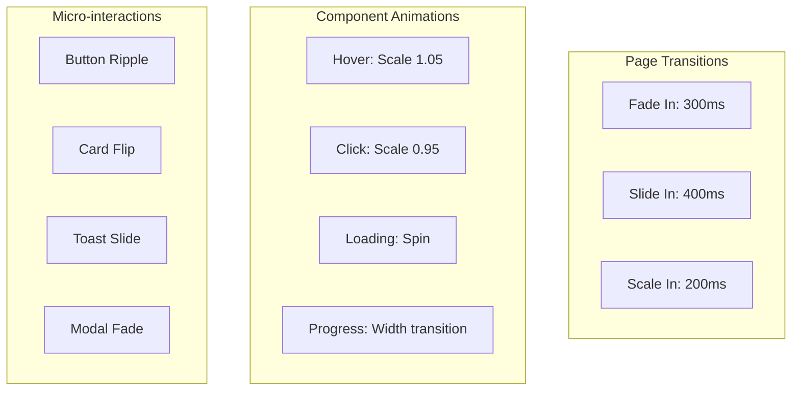

**Timing Functions:**
- Ease In: `cubic-bezier(0.4, 0, 1, 1)`
- Ease Out: `cubic-bezier(0, 0, 0.2, 1)`
- Ease In Out: `cubic-bezier(0.4, 0, 0.2, 1)`

## Accessibility (A11y)

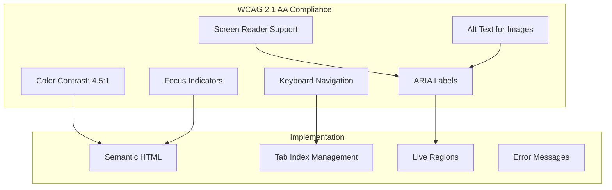

**Требования:**
- Все интерактивные элементы доступны с клавиатуры
- Контраст текста минимум 4.5:1
- ARIA-метки для всех форм
- Фокус-индикаторы видимы
- Альтернативный текст для изображений
- Поддержка screen readers

## User Flow: Прохождение теста

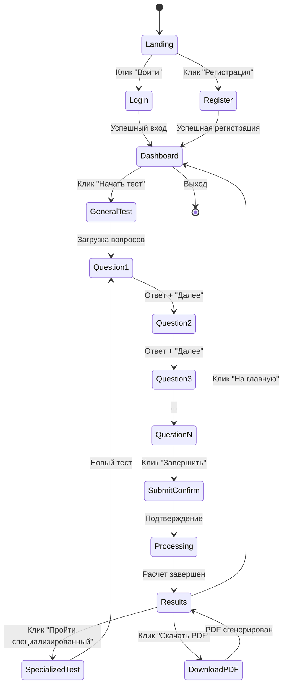

## Error States & Loading States

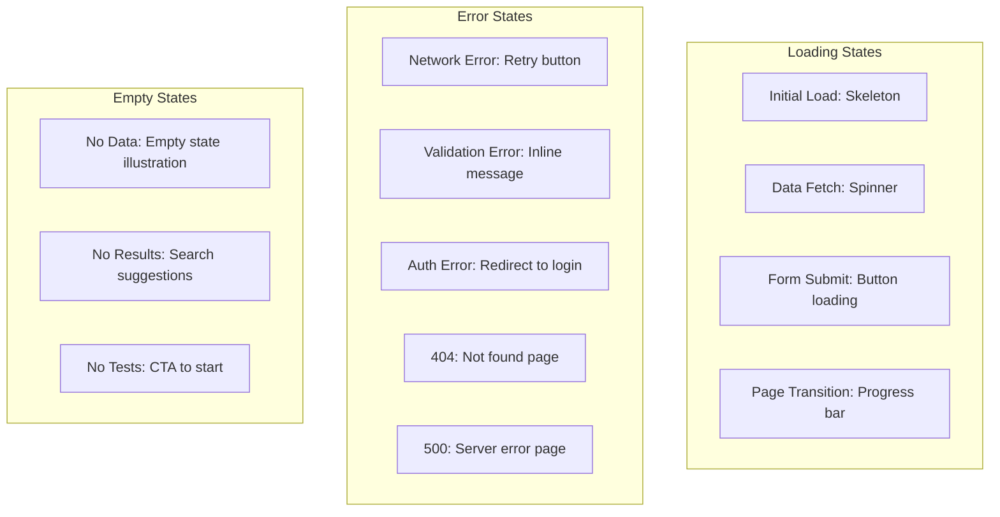

**Обработка ошибок:**
- Inline validation для форм
- Toast notifications для успеха/ошибки
- Retry кнопки для network errors
- Fallback UI для критических ошибок
- Graceful degradation

## Темная тема (Dark Mode)

Система использует темную тему по умолчанию с возможностью переключения:

**Dark Theme (Default):**
- Background: `#0F172A`
- Surface: `#1E293B`
- Text: `#F1F5F9`

**Light Theme (Optional):**
- Background: `#FFFFFF`
- Surface: `#F8FAFC`
- Text: `#0F172A`

Переключение через `prefers-color-scheme` и localStorage.
