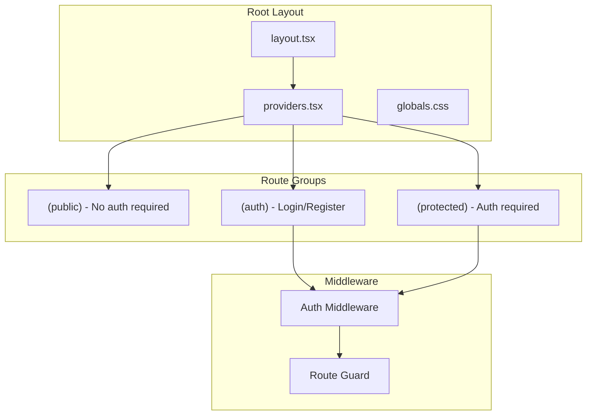
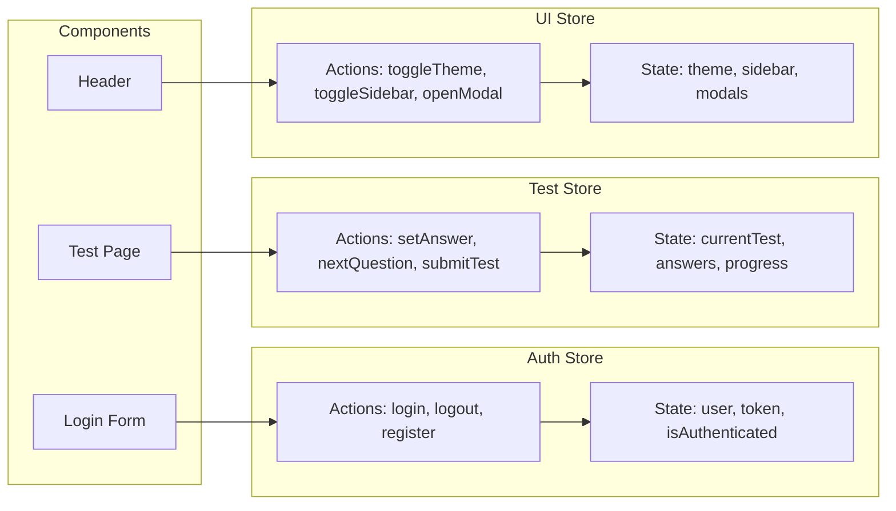
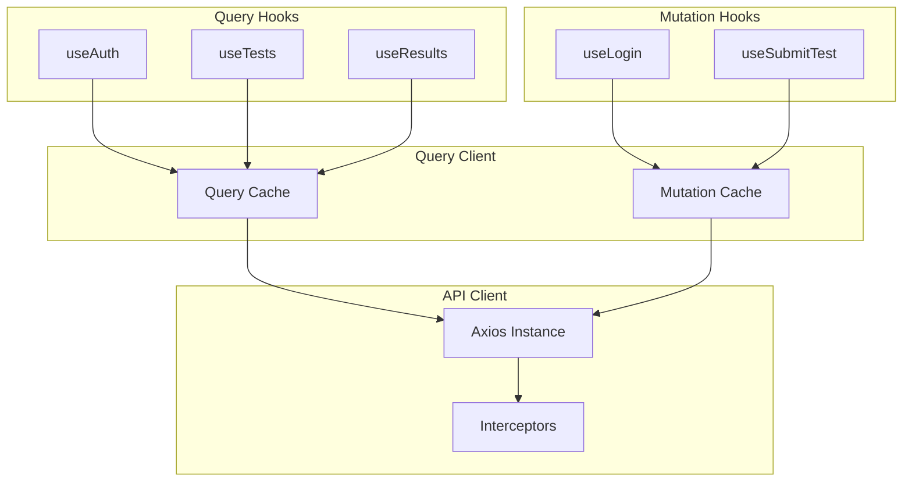
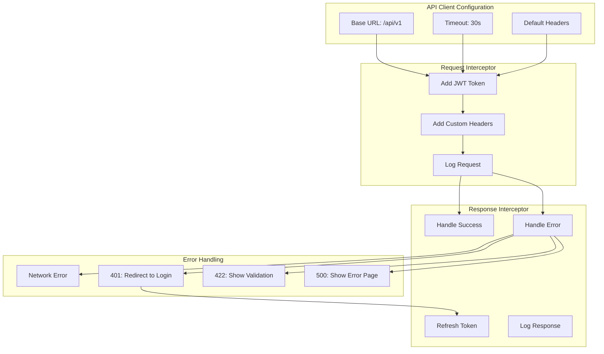
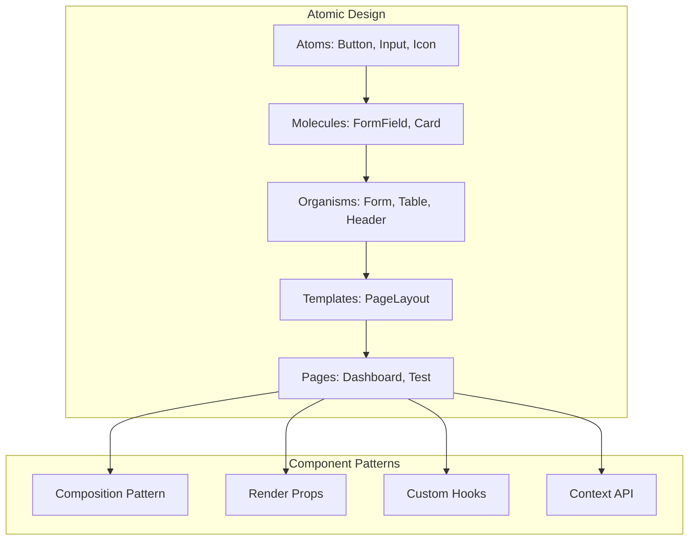
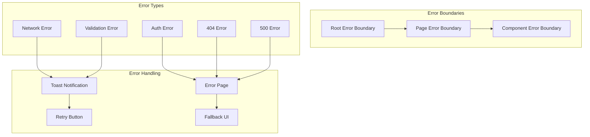
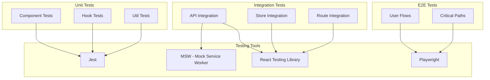

# Схема Frontend архитектуры IT Navigator

## Общая структура Frontend

```mermaid
graph TB
    subgraph "Next.js 14 App Router"
        AppRouter[App Router]
        
        subgraph "Route Groups"
            PublicRoutes["(public)"]
            AuthRoutes["(auth)"]
            ProtectedRoutes["(protected)"]
        end
        
        subgraph "Pages"
            Landing[/ - Landing]
            Login[/login - Login]
            Register[/register - Register]
            Dashboard[/dashboard - Dashboard]
            GeneralTest[/test/general - General Test]
            SpecializedTest[/test/specialized/[code] - Specialized]
            Results[/results - Results List]
            ResultDetail[/results/[id] - Result Detail]
            Profile[/profile - Profile]
            Admin[/admin - Admin Panel]
        end
    end
    
    subgraph "State Management"
        Zustand[Zustand Store]
        
        subgraph "Stores"
            AuthStore[Auth Store]
            TestStore[Test Store]
            UIStore[UI Store]
        end
    end
    
    subgraph "Data Fetching"
        ReactQuery[TanStack Query]
        
        subgraph "Query Hooks"
            useAuth[useAuth]
            useTests[useTests]
            useResults[useResults]
            useUser[useUser]
        end
    end
    
    subgraph "API Layer"
        APIClient[Axios Client]
        
        subgraph "API Modules"
            AuthAPI[Auth API]
            TestsAPI[Tests API]
            ResultsAPI[Results API]
            UserAPI[User API]
        end
    end
    
    subgraph "Components"
        UIComponents[UI Components]
        TestComponents[Test Components]
        ResultComponents[Result Components]
        LayoutComponents[Layout Components]
    end
    
    AppRouter --> PublicRoutes
    AppRouter --> AuthRoutes
    AppRouter --> ProtectedRoutes
    
    PublicRoutes --> Landing
    AuthRoutes --> Login
    AuthRoutes --> Register
    ProtectedRoutes --> Dashboard
    ProtectedRoutes --> GeneralTest
    ProtectedRoutes --> SpecializedTest
    ProtectedRoutes --> Results
    ProtectedRoutes --> ResultDetail
    ProtectedRoutes --> Profile
    ProtectedRoutes --> Admin
    
    Dashboard --> Zustand
    GeneralTest --> Zustand
    SpecializedTest --> Zustand
    
    Zustand --> AuthStore
    Zustand --> TestStore
    Zustand --> UIStore
    
    Dashboard --> ReactQuery
    GeneralTest --> ReactQuery
    Results --> ReactQuery
    
    ReactQuery --> useAuth
    ReactQuery --> useTests
    ReactQuery --> useResults
    ReactQuery --> useUser
    
    useAuth --> APIClient
    useTests --> APIClient
    useResults --> APIClient
    useUser --> APIClient
    
    APIClient --> AuthAPI
    APIClient --> TestsAPI
    APIClient --> ResultsAPI
    APIClient --> UserAPI
    
    Landing --> UIComponents
    Dashboard --> UIComponents
    GeneralTest --> TestComponents
    Results --> ResultComponents
    Dashboard --> LayoutComponents
```

## Структура директорий

```
frontend/
├── src/
│   ├── app/                          # Next.js App Router
│   │   ├── (public)/                # Public route group
│   │   │   ├── page.tsx            # Landing page
│   │   │   └── about/
│   │   │       └── page.tsx        # About page
│   │   │
│   │   ├── (auth)/                 # Auth route group
│   │   │   ├── login/
│   │   │   │   └── page.tsx        # Login page
│   │   │   └── register/
│   │   │       └── page.tsx        # Register page
│   │   │
│   │   ├── (protected)/            # Protected route group
│   │   │   ├── layout.tsx          # Protected layout with auth check
│   │   │   ├── dashboard/
│   │   │   │   └── page.tsx        # Dashboard
│   │   │   ├── test/
│   │   │   │   ├── general/
│   │   │   │   │   └── page.tsx    # General test
│   │   │   │   └── specialized/
│   │   │   │       └── [code]/
│   │   │   │           └── page.tsx # Specialized test
│   │   │   ├── results/
│   │   │   │   ├── page.tsx        # Results list
│   │   │   │   └── [id]/
│   │   │   │       └── page.tsx    # Result detail
│   │   │   ├── profile/
│   │   │   │   └── page.tsx        # User profile
│   │   │   └── admin/
│   │   │       └── page.tsx        # Admin panel
│   │   │
│   │   ├── layout.tsx              # Root layout
│   │   ├── providers.tsx           # React Query provider
│   │   ├── globals.css             # Global styles
│   │   └── error.tsx               # Error boundary
│   │
│   ├── components/                  # React components
│   │   ├── ui/                     # Base UI components
│   │   │   ├── Button.tsx
│   │   │   ├── Input.tsx
│   │   │   ├── Card.tsx
│   │   │   ├── Modal.tsx
│   │   │   ├── Spinner.tsx
│   │   │   ├── Toast.tsx
│   │   │   └── ...
│   │   │
│   │   ├── layout/                 # Layout components
│   │   │   ├── Header.tsx
│   │   │   ├── Sidebar.tsx
│   │   │   ├── Footer.tsx
│   │   │   └── Navigation.tsx
│   │   │
│   │   ├── test/                   # Test-related components
│   │   │   ├── QuestionCard.tsx
│   │   │   ├── AnswerOption.tsx
│   │   │   ├── ProgressBar.tsx
│   │   │   ├── TestNavigation.tsx
│   │   │   └── QuestionSidebar.tsx
│   │   │
│   │   ├── results/                # Results components
│   │   │   ├── ScoreChart.tsx
│   │   │   ├── SpecialtyBreakdown.tsx
│   │   │   ├── Recommendations.tsx
│   │   │   └── ResultCard.tsx
│   │   │
│   │   └── auth/                   # Auth components
│   │       ├── LoginForm.tsx
│   │       ├── RegisterForm.tsx
│   │       └── ProtectedRoute.tsx
│   │
│   ├── lib/                        # Utilities and configs
│   │   ├── api.ts                  # Axios client
│   │   ├── utils.ts                # Helper functions
│   │   ├── constants.ts            # Constants
│   │   └── validators.ts           # Form validators
│   │
│   ├── hooks/                      # Custom React hooks
│   │   ├── useAuth.ts              # Auth hook
│   │   ├── useTests.ts             # Tests hook
│   │   ├── useResults.ts           # Results hook
│   │   ├── useUser.ts              # User hook
│   │   └── useLocalStorage.ts      # LocalStorage hook
│   │
│   ├── store/                      # Zustand stores
│   │   ├── authStore.ts            # Auth state
│   │   ├── testStore.ts            # Test state
│   │   └── uiStore.ts              # UI state
│   │
│   ├── types/                      # TypeScript types
│   │   ├── index.ts                # Main types
│   │   ├── api.ts                  # API types
│   │   ├── test.ts                 # Test types
│   │   └── user.ts                 # User types
│   │
│   └── styles/                     # Additional styles
│       ├── animations.css          # Animations
│       └── themes.css              # Theme variables
│
├── public/                         # Static assets
│   ├── images/
│   ├── icons/
│   └── fonts/
│
├── .env.local                      # Environment variables
├── next.config.js                  # Next.js config
├── tailwind.config.js              # Tailwind config
├── tsconfig.json                   # TypeScript config
└── package.json                    # Dependencies
```

## Компоненты и их взаимодействие

### 1. App Router (Next.js 14)



**Ключевые файлы:**

- `app/layout.tsx`: Корневой layout с провайдерами
- `app/providers.tsx`: React Query и другие провайдеры
- `app/(protected)/layout.tsx`: Layout с проверкой авторизации
- `middleware.ts`: Next.js middleware для защиты роутов

### 2. State Management (Zustand)



**authStore.ts:**
```typescript
interface AuthState {
  user: User | null;
  token: string | null;
  isAuthenticated: boolean;
  login: (email: string, password: string) => Promise<void>;
  logout: () => void;
  register: (data: RegisterData) => Promise<void>;
}
```

**testStore.ts:**
```typescript
interface TestState {
  currentTest: Test | null;
  currentQuestionIndex: number;
  answers: Record<number, number[]>;
  startTime: Date | null;
  setAnswer: (questionId: number, answerIds: number[]) => void;
  nextQuestion: () => void;
  prevQuestion: () => void;
  submitTest: () => Promise<void>;
  resetTest: () => void;
}
```

**uiStore.ts:**
```typescript
interface UIState {
  theme: 'dark' | 'light';
  sidebarOpen: boolean;
  activeModal: string | null;
  toggleTheme: () => void;
  toggleSidebar: () => void;
  openModal: (modalId: string) => void;
  closeModal: () => void;
}
```

### 3. Data Fetching (TanStack Query)



**useAuth.ts:**
```typescript
export const useAuth = () => {
  return useQuery({
    queryKey: ['auth', 'me'],
    queryFn: () => api.get('/auth/me'),
    staleTime: 5 * 60 * 1000, // 5 minutes
  });
};

export const useLogin = () => {
  const queryClient = useQueryClient();
  
  return useMutation({
    mutationFn: (credentials: LoginCredentials) => 
      api.post('/auth/login', credentials),
    onSuccess: (data) => {
      queryClient.setQueryData(['auth', 'me'], data.user);
      localStorage.setItem('token', data.token);
    },
  });
};
```

**useTests.ts:**
```typescript
export const useGeneralTest = () => {
  return useQuery({
    queryKey: ['tests', 'general', 'questions'],
    queryFn: () => api.get('/tests/general/questions'),
    staleTime: 0, // Always fresh (questions are shuffled)
  });
};

export const useSubmitTest = () => {
  const queryClient = useQueryClient();
  
  return useMutation({
    mutationFn: (data: TestSubmission) => 
      api.post('/tests/general/submit', data),
    onSuccess: () => {
      queryClient.invalidateQueries(['results']);
    },
  });
};
```

**useResults.ts:**
```typescript
export const useResults = () => {
  return useQuery({
    queryKey: ['results', 'my'],
    queryFn: () => api.get('/tests/results/my'),
    staleTime: 1 * 60 * 1000, // 1 minute
  });
};

export const useResultDetail = (id: string) => {
  return useQuery({
    queryKey: ['results', id],
    queryFn: () => api.get(`/tests/results/${id}`),
    enabled: !!id,
  });
};
```

### 4. API Client (Axios)



**lib/api.ts:**
```typescript
import axios from 'axios';

const api = axios.create({
  baseURL: process.env.NEXT_PUBLIC_API_URL,
  timeout: 30000,
  headers: {
    'Content-Type': 'application/json',
  },
});

// Request interceptor
api.interceptors.request.use(
  (config) => {
    const token = localStorage.getItem('token');
    if (token) {
      config.headers.Authorization = `Bearer ${token}`;
    }
    return config;
  },
  (error) => Promise.reject(error)
);

// Response interceptor
api.interceptors.response.use(
  (response) => response.data,
  (error) => {
    if (error.response?.status === 401) {
      localStorage.removeItem('token');
      window.location.href = '/login';
    }
    return Promise.reject(error);
  }
);

export default api;
```

### 5. Component Architecture



**Пример компонента:**

```typescript
// components/test/QuestionCard.tsx
interface QuestionCardProps {
  question: Question;
  selectedAnswers: number[];
  onAnswerSelect: (answerId: number) => void;
}

export const QuestionCard: React.FC<QuestionCardProps> = ({
  question,
  selectedAnswers,
  onAnswerSelect,
}) => {
  return (
    <Card className="p-6">
      <h3 className="text-xl font-semibold mb-4">
        {question.text}
      </h3>
      
      <div className="space-y-3">
        {question.answers.map((answer) => (
          <AnswerOption
            key={answer.id}
            answer={answer}
            isSelected={selectedAnswers.includes(answer.id)}
            onSelect={() => onAnswerSelect(answer.id)}
          />
        ))}
      </div>
    </Card>
  );
};
```

### 6. Routing и Navigation

```mermaid
graph TB
    subgraph "Public Routes"
        Home[/ - Home]
        About[/about - About]
    end
    
    subgraph "Auth Routes"
        Login[/login - Login]
        Register[/register - Register]
    end
    
    subgraph "Protected Routes"
        Dashboard[/dashboard - Dashboard]
        
        subgraph "Test Routes"
            GeneralTest[/test/general]
            SpecializedTest[/test/specialized/[code]]
        end
        
        subgraph "Result Routes"
            Results[/results]
            ResultDetail[/results/[id]]
        end
        
        Profile[/profile]
        Admin[/admin]
    end
    
    subgraph "Navigation Guards"
        AuthGuard[Auth Guard]
        AdminGuard[Admin Guard]
    end
    
    Home --> Login
    Login --> Dashboard
    Register --> Dashboard
    
    Dashboard --> AuthGuard
    GeneralTest --> AuthGuard
    SpecializedTest --> AuthGuard
    Results --> AuthGuard
    Profile --> AuthGuard
    
    Admin --> AdminGuard
    AdminGuard --> AuthGuard
```

**middleware.ts:**
```typescript
import { NextResponse } from 'next/server';
import type { NextRequest } from 'next/server';

export function middleware(request: NextRequest) {
  const token = request.cookies.get('token');
  const isAuthPage = request.nextUrl.pathname.startsWith('/login') ||
                     request.nextUrl.pathname.startsWith('/register');
  const isProtectedPage = request.nextUrl.pathname.startsWith('/dashboard') ||
                          request.nextUrl.pathname.startsWith('/test') ||
                          request.nextUrl.pathname.startsWith('/results');

  if (isProtectedPage && !token) {
    return NextResponse.redirect(new URL('/login', request.url));
  }

  if (isAuthPage && token) {
    return NextResponse.redirect(new URL('/dashboard', request.url));
  }

  return NextResponse.next();
}

export const config = {
  matcher: ['/((?!api|_next/static|_next/image|favicon.ico).*)'],
};
```

### 7. Performance Optimization

```mermaid
graph TB
    subgraph "Code Splitting"
        DynamicImport[Dynamic Import]
        LazyLoading[Lazy Loading]
        RouteBasedSplitting[Route-based Splitting]
    end
    
    subgraph "Caching"
        ReactQueryCache[React Query Cache]
        BrowserCache[Browser Cache]
        ServiceWorker[Service Worker]
    end
    
    subgraph "Optimization"
        ImageOptimization[Next.js Image]
        FontOptimization[Font Optimization]
        BundleAnalysis[Bundle Analysis]
    end
    
    subgraph "Rendering"
        SSR[Server-Side Rendering]
        SSG[Static Site Generation]
        ISR[Incremental Static Regeneration]
        CSR[Client-Side Rendering]
    end
    
    DynamicImport --> LazyLoading
    LazyLoading --> RouteBasedSplitting
    
    ReactQueryCache --> BrowserCache
    BrowserCache --> ServiceWorker
    
    ImageOptimization --> FontOptimization
    FontOptimization --> BundleAnalysis
    
    SSR --> SSG
    SSG --> ISR
    ISR --> CSR
```



**Стратегии рендеринга:**

- **SSG**: Landing page, About page
- **SSR**: Dashboard (требует auth)
- **CSR**: Test pages (динамический контент)
- **ISR**: Results pages (кэш с revalidation)

### 8. Error Handling



**app/error.tsx:**
```typescript
'use client';

export default function Error({
  error,
  reset,
}: {
  error: Error & { digest?: string };
  reset: () => void;
}) {
  return (
    <div className="flex flex-col items-center justify-center min-h-screen">
      <h2 className="text-2xl font-bold mb-4">Something went wrong!</h2>
      <p className="text-gray-600 mb-4">{error.message}</p>
      <button
        onClick={reset}
        className="px-4 py-2 bg-blue-500 text-white rounded"
      >
        Try again
      </button>
    </div>
  );
}
```

### 9. Testing Strategy



### 10. Build и Deploy

```mermaid
graph LR
    subgraph "Development"
        DevServer[npm run dev]
        HMR[Hot Module Replacement]
    end
    
    subgraph "Build"
        TypeCheck[Type Check]
        Lint[ESLint]
        Build[npm run build]
        Optimize[Optimization]
    end
    
    subgraph "Deploy"
        Docker[Docker Build]
        Nginx[Nginx Static]
        CDN[CDN Distribution]
    end
    
    DevServer --> HMR
    
    TypeCheck --> Lint
    Lint --> Build
    Build --> Optimize
    
    Optimize --> Docker
    Docker --> Nginx
    Nginx --> CDN
```

**package.json scripts:**
```json
{
  "scripts": {
    "dev": "next dev",
    "build": "next build",
    "start": "next start",
    "lint": "next lint",
    "type-check": "tsc --noEmit",
    "test": "jest",
    "test:watch": "jest --watch",
    "test:e2e": "playwright test"
  }
}
```
