# Потоки данных IT Navigator

## Обзор потоков данных

Этот документ описывает все основные потоки данных в системе IT Navigator, включая взаимодействие между компонентами, обработку запросов и управление состоянием.

## 1. Поток регистрации пользователя

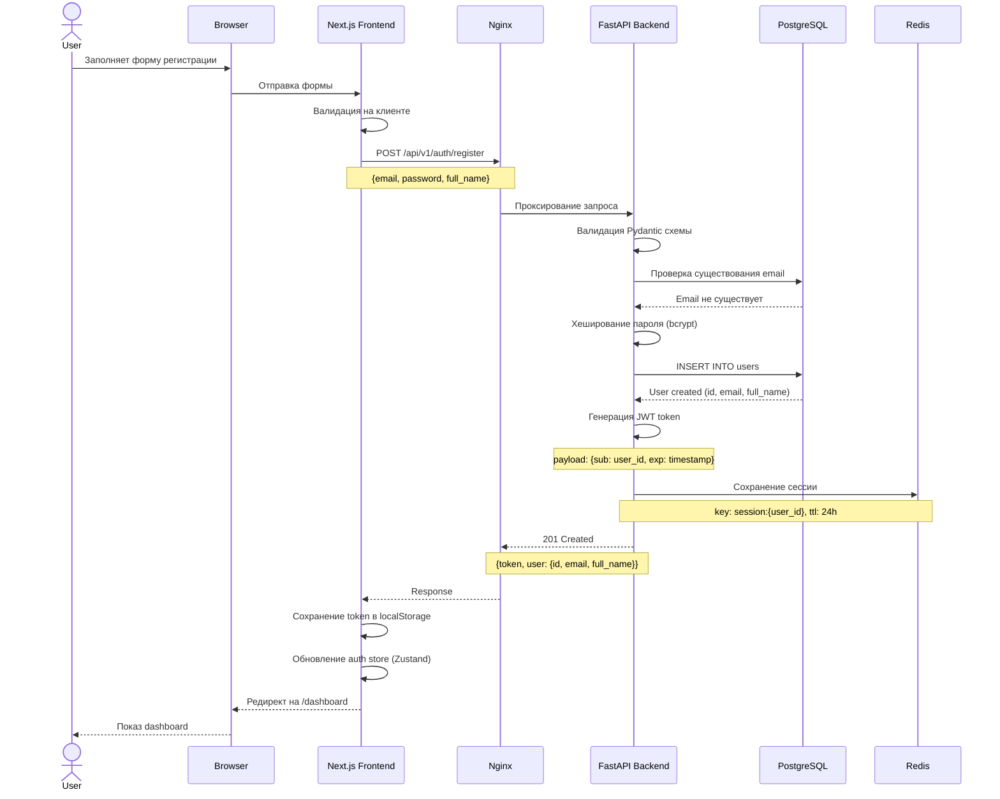

**Ключевые моменты:**
- Валидация происходит на двух уровнях: клиент (React Hook Form) и сервер (Pydantic)
- Пароль хешируется с использованием bcrypt (cost factor: 12)
- JWT token содержит только user_id и expiration
- Сессия кэшируется в Redis для быстрой валидации
- Token сохраняется в localStorage и автоматически добавляется к запросам через Axios interceptor

## 2. Поток аутентификации (Login)

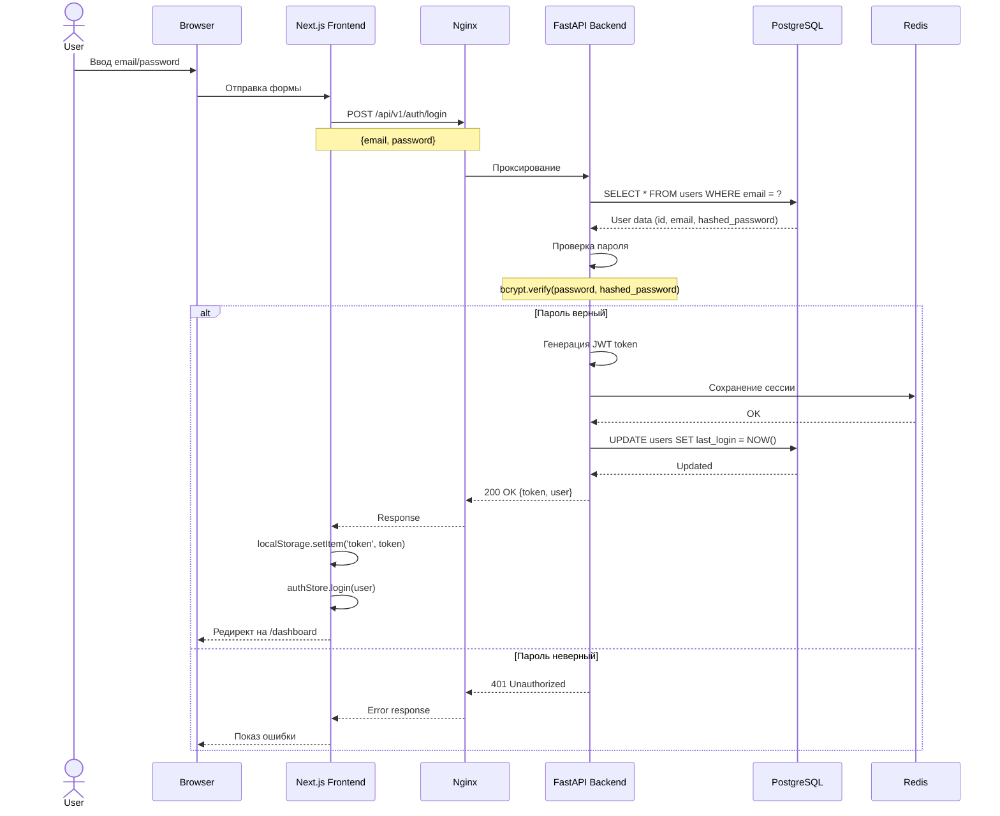

**Ключевые моменты:**
- Используется OAuth2PasswordBearer для стандартизации
- При неудачной попытке логина не раскрывается, существует ли email
- Last login timestamp обновляется при успешном входе
- Token автоматически добавляется ко всем последующим запросам

## 3. Поток получения вопросов теста

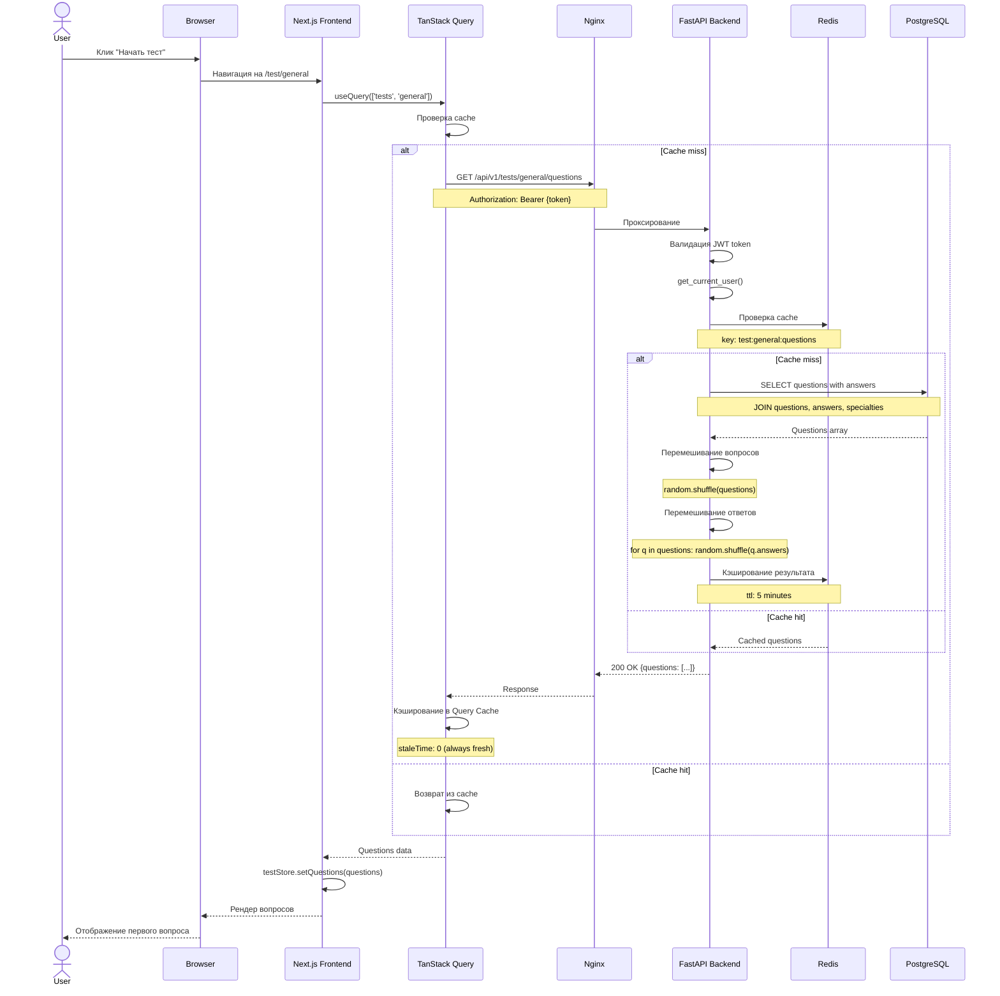

**Ключевые моменты:**
- Двухуровневое кэширование: Redis (backend) + React Query (frontend)
- Вопросы и ответы перемешиваются на сервере для предотвращения запоминания
- React Query не кэширует результат (staleTime: 0), так как каждый запрос должен возвращать новый порядок
- Redis cache используется для снижения нагрузки на БД при множественных запросах

## 4. Поток прохождения теста

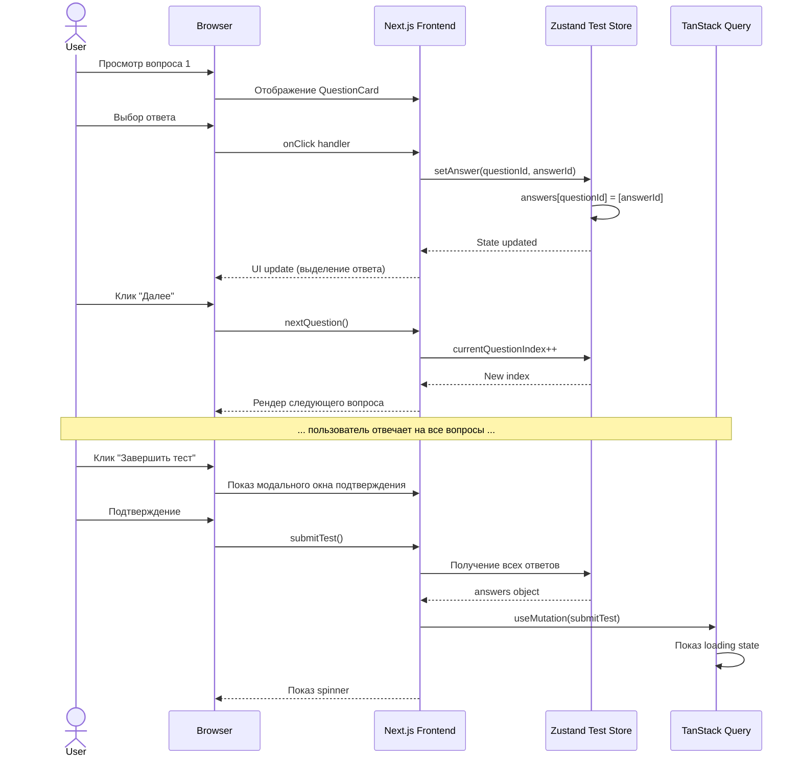

**Ключевые моменты:**
- Все ответы хранятся локально в Zustand store
- Нет автосохранения на сервер (все отправляется одним запросом)
- Пользователь может вернуться к предыдущим вопросам и изменить ответы
- Sidebar показывает статус каждого вопроса (отвечен/не отвечен)

## 5. Поток отправки и обработки результатов теста

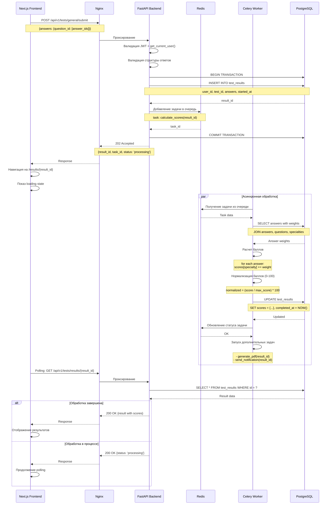

**Ключевые моменты:**
- Асинхронная обработка через Celery для тяжелых вычислений
- Немедленный ответ клиенту (202 Accepted) с последующим polling
- Транзакционная безопасность при создании результата
- Retry механизм в Celery для обработки ошибок
- Дополнительные задачи (PDF, email) запускаются после основной обработки

## 6. Поток отображения результатов

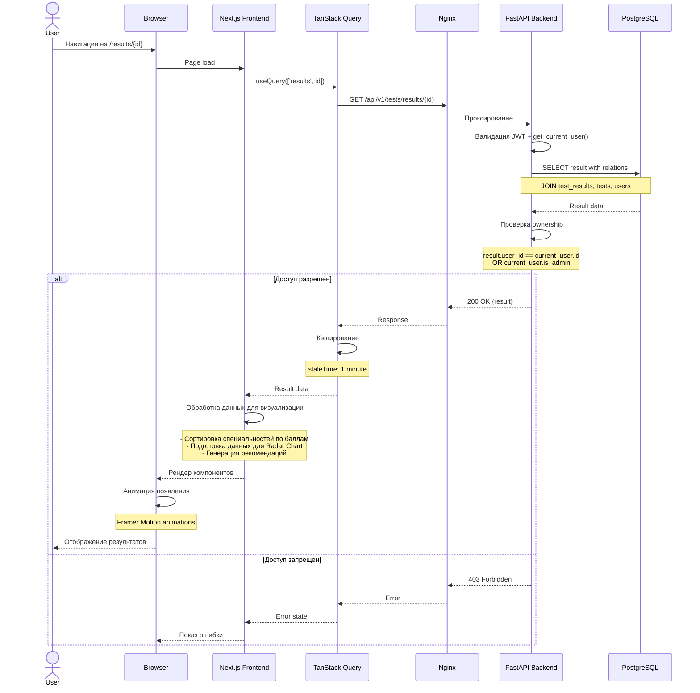

**Ключевые моменты:**
- Проверка прав доступа на уровне API (только владелец или админ)
- Кэширование результатов в React Query (1 минута)
- Клиентская обработка данных для визуализации
- Анимации для улучшения UX

## 7. Поток скачивания PDF

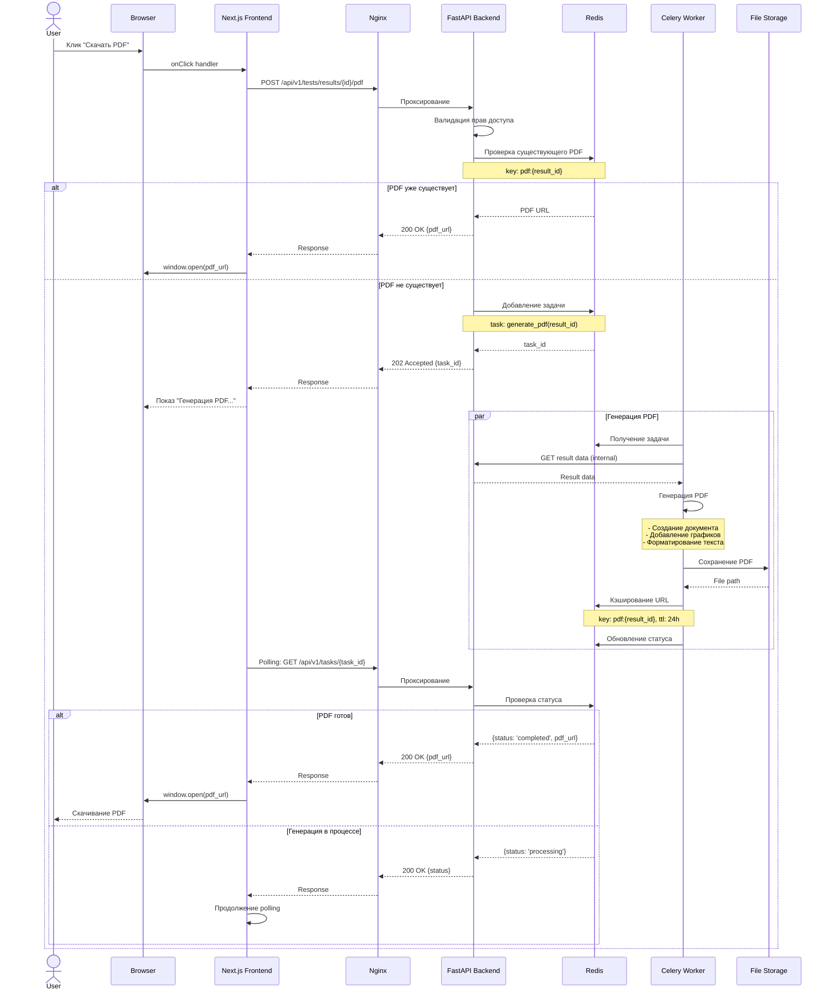

**Ключевые моменты:**
- Кэширование сгенерированных PDF (24 часа)
- Асинхронная генерация для больших документов
- Polling для отслеживания прогресса
- Хранение файлов в отдельном storage (может быть S3, local filesystem)

## 8. Поток работы с Admin Panel

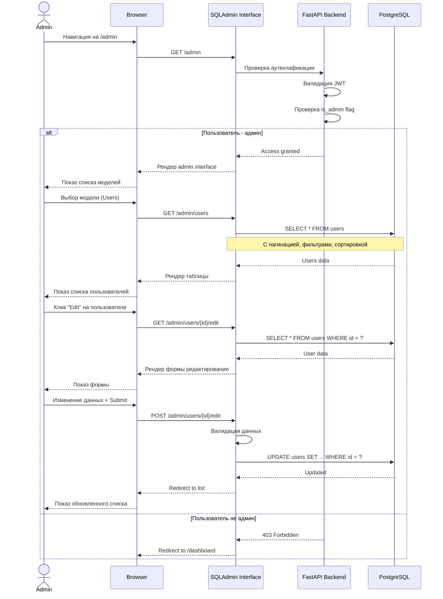

**Ключевые моменты:**
- Двойная проверка прав: JWT + is_admin flag
- CRUD операции через SQLAdmin ORM
- Автоматическая валидация через SQLAlchemy models
- Поддержка фильтрации, сортировки, пагинации
- Audit log для отслеживания изменений (опционально)

## 9. Поток кэширования и инвалидации

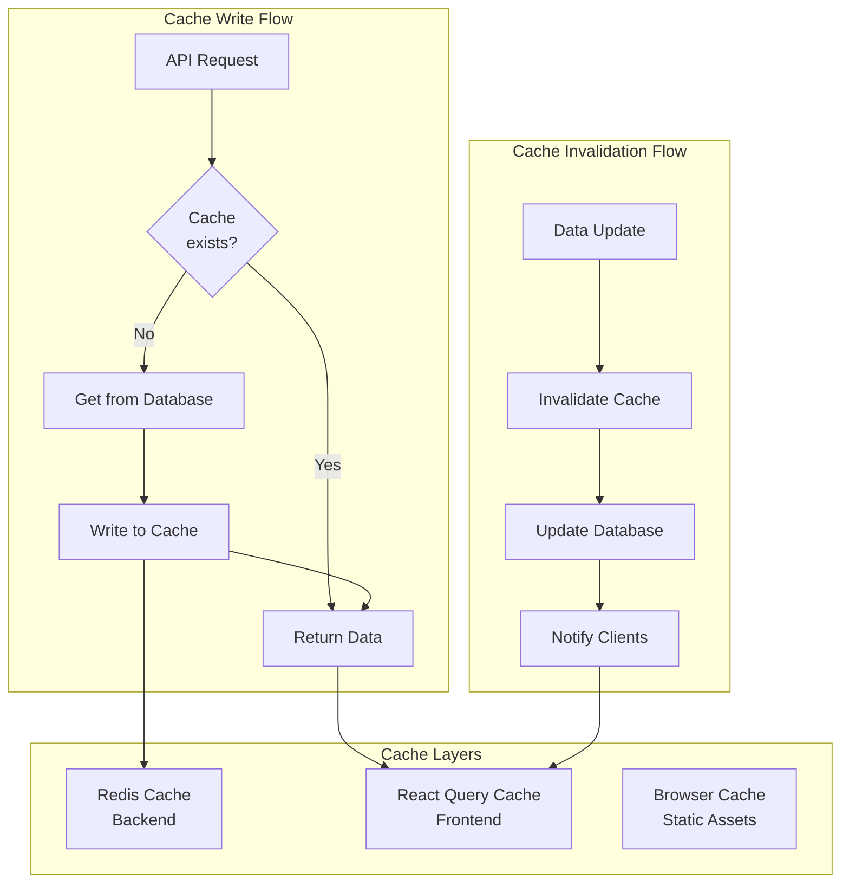

**Стратегии кэширования:**

| Тип данных | Backend Cache (Redis) | Frontend Cache (React Query) | TTL |
|------------|----------------------|------------------------------|-----|
| Test Questions | 5 минут | 0 (always fresh) | Короткий |
| User Session | 24 часа | 5 минут | Длинный |
| Test Results | 10 минут | 1 минута | Средний |
| Specialty Data | 1 час | 10 минут | Длинный |
| Static Content | - | Infinity | Постоянный |

**Инвалидация кэша:**
- При обновлении данных через Admin Panel
- При создании нового результата теста
- При изменении профиля пользователя
- Автоматическая инвалидация по TTL

## 10. Поток обработки ошибок

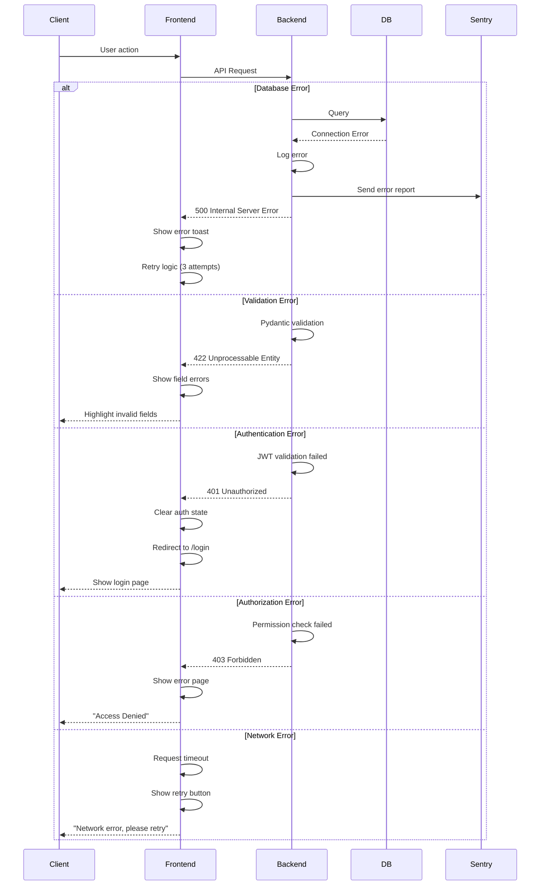

**Обработка ошибок:**
- **500 Errors**: Логирование + отправка в Sentry + retry
- **422 Errors**: Показ inline validation errors
- **401 Errors**: Очистка auth state + редирект на login
- **403 Errors**: Показ страницы "Access Denied"
- **Network Errors**: Retry с exponential backoff

## 11. Поток WebSocket (Real-time Updates) - Будущее расширение

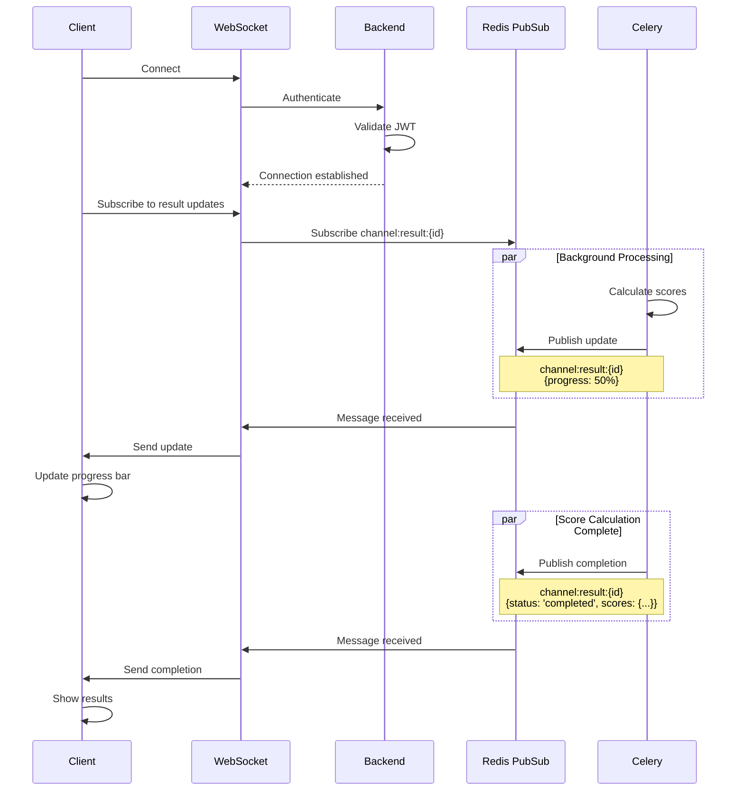

**Примечание:** WebSocket функционал планируется для будущих версий для real-time обновлений прогресса обработки тестов.

## Резюме потоков данных

### Синхронные потоки
1. **Аутентификация** - немедленный ответ с JWT token
2. **Получение вопросов** - с кэшированием на двух уровнях
3. **Просмотр результатов** - прямой запрос к БД с проверкой прав

### Асинхронные потоки
1. **Расчет баллов** - через Celery с polling
2. **Генерация PDF** - через Celery с кэшированием
3. **Email уведомления** - фоновая задача без ожидания

### Критические точки производительности
1. **Перемешивание вопросов** - кэшируется в Redis
2. **Расчет баллов** - выполняется асинхронно
3. **Генерация PDF** - кэшируется на 24 часа
4. **Сессии пользователей** - кэшируются в Redis

### Точки отказоустойчивости
1. **Retry механизм** в Celery (3 попытки)
2. **Транзакции** в PostgreSQL
3. **Graceful degradation** при недоступности Redis
4. **Error boundaries** в React компонентах
